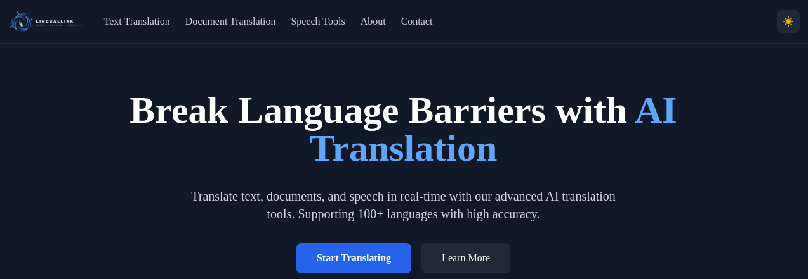

# LingualLink Translator

A modern, full-stack translation application built with Next.js 13+, MongoDB, and Prisma. This application provides real-time translation services with support for text, documents, and speech across 100+ languages.



## Features

- 🌐 Text Translation

  - Real-time translation
  - Support for 100+ languages
  - Auto-language detection
  - Translation history

- 📄 Document Translation

  - Support for PDF, DOCX, and TXT files
  - Maintains document formatting
  - Batch translation capability

- 🗣️ Speech Tools

  - Speech-to-Text conversion
  - Text-to-Speech output
  - Multiple language support
  - Real-time transcription

- 🎨 Modern UI/UX

  - Responsive design
  - Dark/Light mode
  - Mobile-friendly interface
  - Accessible components

- 💾 Data Persistence
  - MongoDB integration
  - Translation history
  - User preferences storage
  - Efficient data querying

## Tech Stack

- **Frontend**

  - Next.js 13+
  - React 18
  - TailwindCSS
  - TypeScript

- **Backend**

  - Next.js API Routes
  - MongoDB
  - Prisma ORM
  - MyMemory Translation API

- **Infrastructure**
  - Vercel (Deployment)
  - MongoDB Atlas (Database)
  - GitHub (Version Control)

## Getting Started

### Prerequisites

- Node.js 16+
- MongoDB Atlas account
- npm or yarn

### Installation

1. Clone the repository:

```bash
git clone https://github.com/Deviskalo/lingual-link.git
cd lingual-link
```

2. Install dependencies:

```bash
npm install
```

3. Set up environment variables:

```bash
cp .env.example .env.local
```

Edit `.env.example` with your MongoDB connection string and other relevent.

4. Set up the database:

```bash
npx prisma generate
npx prisma db push
```

5. Seed the database with languages:

```bash
npm run seed
```

6. Start the development server:

```bash
npm run dev
```

Visit `http://localhost:3000` to see the application.

### Production Deployment

1. Build the application:

```bash
npm run build
```

2. Start the production server:

```bash
npm start
```

## Project Structure

```ai-translator/
├── app/ # Next.js 13+ app directory
│ ├── api/ # API routes
│ ├── lib/ # Shared utilities
│ └── [routes]/ # Page components
├── components/ # React components
├── hooks/ # Custom React hooks
├── prisma/ # Prisma schema and migrations
├── public/ # Static assets
└── types/ # TypeScript type definitions
└── scripts/ # Contain a script for updating the LICENSE base on the current year
```

## API Routes

- `POST /api/translate` - Text translation
- `POST /api/translate-file` - Document translation
- `POST /api/detect-language` - Language detection
- `GET /api/history` - Translation history
- `DELETE /api/history/[id]` - Delete translation

## Contributing

1. Fork the repository
2. Create your feature branch (`git checkout -b feature/AmazingFeature`)
3. Commit your changes (`git commit -m 'Add some AmazingFeature'`)
4. Push to the branch (`git push origin feature/AmazingFeature`)
5. Open a Pull Request

## License

This project is licensed under the MIT License - see the [LICENSE](LICENSE) file for details.

## Acknowledgments

- [Next.js](https://nextjs.org/)
- [Prisma](https://www.prisma.io/)
- [MongoDB](https://www.mongodb.com/)
- [TailwindCSS](https://tailwindcss.com/)
- [MyMemory Translation API](https://mymemory.translated.net/)

## Contact

Dev Iskalo - [@dev_iskalo](https://twitter.com/@dev_iskalo)

Project Link: [https://github.com/Deviskalo/lingual-link](https://github.com/Deviskalo/lingual-link)
